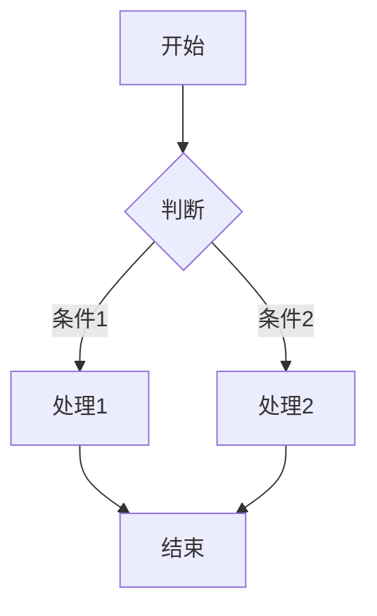

# 高级功能探索

Astro Icarus 主题不仅提供了基础的博客功能，还内置了许多高级特性。本指南将带你深入了解这些高级功能，让你的博客更加强大。

## 搜索功能

### 内置搜索

主题内置了基于 Fuse.js 的搜索功能，无需额外配置即可使用。

**搜索范围**
- 文章标题
- 文章描述
- 文章内容
- 标签

**使用方法**

1. 点击导航栏的搜索图标
2. 输入关键词
3. 查看搜索结果

### 搜索配置

在 `src/config.ts` 中配置搜索：

```typescript
export const SEARCH_CONFIG = {
  enabled: true,
  provider: 'fuse',  // fuse, algolia
  fuse: {
    keys: ['title', 'description', 'content', 'tags'],
    threshold: 0.3,
  },
};
```

### Algolia 搜索

对于大型博客，可以使用 Algolia 提供更强大的搜索功能。

**配置步骤**

1. 注册 [Algolia](https://www.algolia.com) 账号
2. 创建应用和索引
3. 配置 DocSearch
4. 在主题中配置：

```typescript
export const SEARCH_CONFIG = {
  provider: 'algolia',
  algolia: {
    appId: 'YOUR_APP_ID',
    apiKey: 'YOUR_API_KEY',
    indexName: 'YOUR_INDEX_NAME',
  },
};
```

## 网站分析

### Google Analytics

**配置步骤**

1. 注册 [Google Analytics](https://analytics.google.com)
2. 创建数据流，获取测量 ID
3. 在 `src/config.ts` 中配置：

```typescript
export const ANALYTICS_CONFIG = {
  google: 'G-XXXXXXXXXX',
};
```

### 百度统计

**配置步骤**

1. 注册 [百度统计](https://tongji.baidu.com)
2. 添加网站，获取统计代码
3. 在 `src/config.ts` 中配置：

```typescript
export const ANALYTICS_CONFIG = {
  baidu: 'your-baidu-id',
};
```

### Umami

Umami 是一个开源、自托管的网站分析工具，注重隐私保护。

**配置步骤**

1. 部署 Umami 服务
2. 添加网站，获取追踪代码
3. 在 `src/config.ts` 中配置：

```typescript
export const ANALYTICS_CONFIG = {
  umami: {
    websiteId: 'your-website-id',
    src: 'https://your-umami-domain/umami.js',
  },
};
```

## PWA 支持

### 什么是 PWA

PWA（Progressive Web App）是一种使用现代 Web 技术构建的应用程序，可以提供类似原生应用的体验。

### PWA 特性

- **离线访问** - 缓存资源，离线可用
- **添加到主屏幕** - 像原生应用一样安装
- **推送通知** - 发送通知给用户
- **后台同步** - 后台数据同步

### 启用 PWA

**步骤 1：安装依赖**

```bash
pnpm add @vite-pwa/astro
```

**步骤 2：配置 Astro**

```javascript
// astro.config.mjs
import { VitePWA } from '@vite-pwa/astro';

export default defineConfig({
  integrations: [
    VitePWA({
      registerType: 'autoUpdate',
      manifest: {
        name: '我的博客',
        short_name: 'Blog',
        description: '我的个人博客',
        theme_color: '#2563eb',
        icons: [
          {
            src: '/icon-192x192.png',
            sizes: '192x192',
            type: 'image/png',
          },
          {
            src: '/icon-512x512.png',
            sizes: '512x512',
            type: 'image/png',
          },
        ],
      },
    }),
  ],
});
```

**步骤 3：添加图标**

在 `public` 目录下添加 PWA 图标：
- `icon-192x192.png`
- `icon-512x512.png`

## RSS 订阅

### 什么是 RSS

RSS（Really Simple Syndication）是一种内容聚合格式，用户可以通过 RSS 阅读器订阅博客更新。

### RSS 配置

主题自动生成 RSS Feed，无需额外配置。

**访问地址**

```
/rss.xml
```

**自定义配置**

```typescript
// src/config.ts
export const RSS_CONFIG = {
  enabled: true,
  title: '我的博客',
  description: '我的个人博客 RSS 订阅',
  customData: `<language>zh-CN</language>`,
};
```

## Sitemap

### 什么是 Sitemap

Sitemap 是网站的地图文件，帮助搜索引擎更好地抓取网站内容。

### Sitemap 配置

主题自动生成 Sitemap，无需额外配置。

**访问地址**

```
/sitemap-index.xml
```

**自定义配置**

```typescript
// astro.config.mjs
import sitemap from '@astrojs/sitemap';

export default defineConfig({
  integrations: [
    sitemap({
      filter: (page) => !page.includes('/admin/'),
      customPages: ['https://example.com/custom-page/'],
    }),
  ],
});
```

## 图片优化

### 自动图片优化

主题使用 Astro 的 `<Image>` 组件自动优化图片。

**使用方法**

```astro
---
import { Image } from 'astro:assets';
import myImage from '../images/my-image.jpg';
---

<Image src={myImage} alt="图片描述" width={800} height={600} />
```

### 图片格式

**推荐格式**

| 格式 | 适用场景 |
|------|---------|
| WebP | 通用，压缩率高 |
| AVIF | 新一代格式，压缩率更高 |
| JPEG | 照片 |
| PNG | 透明背景 |
| SVG | 图标、Logo |

### 懒加载

主题自动为图片添加懒加载：

```html

```

## 代码高亮

### Shiki 代码高亮

主题使用 Shiki 进行代码高亮，支持 100+ 种语言。

**配置**

```javascript
// astro.config.mjs
export default defineConfig({
  markdown: {
    shikiConfig: {
      theme: 'github-light',
      themes: {
        light: 'github-light',
        dark: 'github-dark',
      },
      wrap: true,
    },
  },
});
```

### 代码块功能

主题为代码块添加了以下功能：

1. **复制按钮** - 一键复制代码
2. **折叠功能** - 长代码自动折叠
3. **主题切换** - 跟随网站主题

## 数学公式

### KaTeX 支持

主题内置 KaTeX 支持，可以渲染数学公式。

**行内公式**

```markdown
$E = mc^2$
```

**块级公式**

```markdown
$$
\sum_{i=1}^{n} x_i = x_1 + x_2 + \cdots + x_n
$$
```

### 配置

```typescript
// src/config.ts
export const MATH_CONFIG = {
  enabled: true,
  engine: 'katex',
};
```

## Mermaid 图表

### 什么是 Mermaid

Mermaid 是一个基于 JavaScript 的图表绘制工具，可以使用 Markdown 语法绘制流程图、时序图等。

### 使用方法

```markdown

```

### 启用 Mermaid

在 `BaseLayout.astro` 中添加：

```html
<script src="https://cdn.jsdelivr.net/npm/mermaid@10/dist/mermaid.min.js"></script>
<script>
  mermaid.initialize({ startOnLoad: true });
</script>
```

## 国际化

### 多语言支持

主题支持多语言配置。

**配置**

```typescript
// src/config.ts
export const I18N_CONFIG = {
  defaultLocale: 'zh-CN',
  locales: ['zh-CN', 'en-US'],
  labels: {
    'zh-CN': {
      home: '首页',
      archive: '归档',
      category: '分类',
      tag: '标签',
    },
    'en-US': {
      home: 'Home',
      archive: 'Archive',
      category: 'Category',
      tag: 'Tag',
    },
  },
};
```

## 暗黑模式

### 自动切换

主题支持自动跟随系统主题切换。

### 手动切换

用户可以通过导航栏的主题切换按钮手动切换。

### 配置**

```typescript
// src/config.ts
export const THEME_CONFIG = {
  defaultTheme: 'auto',  // light, dark, auto
  respectPrefersColorScheme: true,
};
```

## 动画效果

### 页面过渡动画

主题内置了页面过渡动画效果。

### 滚动动画

使用 Intersection Observer 实现滚动动画。

### 配置**

```typescript
// src/config.ts
export const ANIMATION_CONFIG = {
  enabled: true,
  pageTransition: true,
  scrollReveal: true,
};
```

## 安全功能

### CSP 配置

内容安全策略（CSP）可以防止 XSS 攻击。

```javascript
// astro.config.mjs
export default defineConfig({
  security: {
    headers: {
      'Content-Security-Policy': "default-src 'self'",
    },
  },
});
```

### 其他安全头

```javascript
// astro.config.mjs
export default defineConfig({
  security: {
    headers: {
      'X-Frame-Options': 'DENY',
      'X-Content-Type-Options': 'nosniff',
      'Referrer-Policy': 'strict-origin-when-cross-origin',
    },
  },
});
```

## 下一步

- 学习[性能优化](/blog/09-performance)
- 了解[安全加固](/blog/10-security)
- 探索[插件开发](/blog/11-plugin-development)
